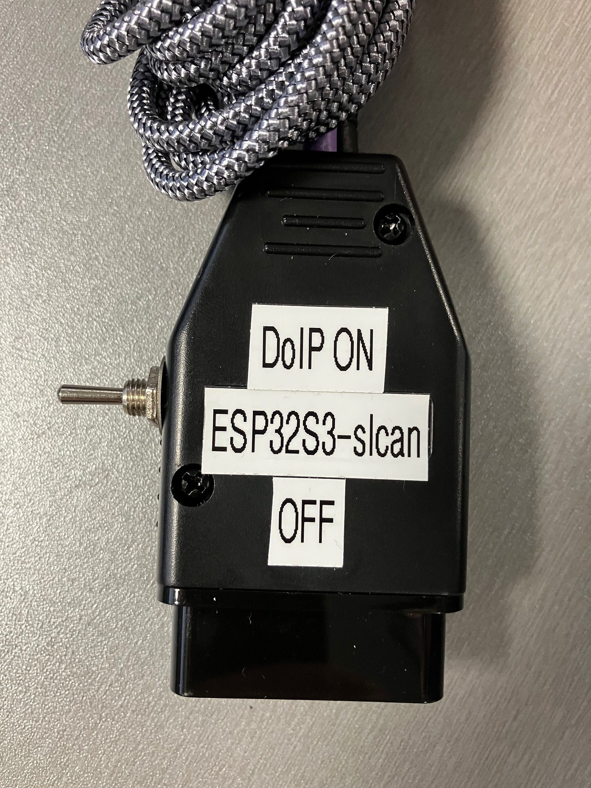
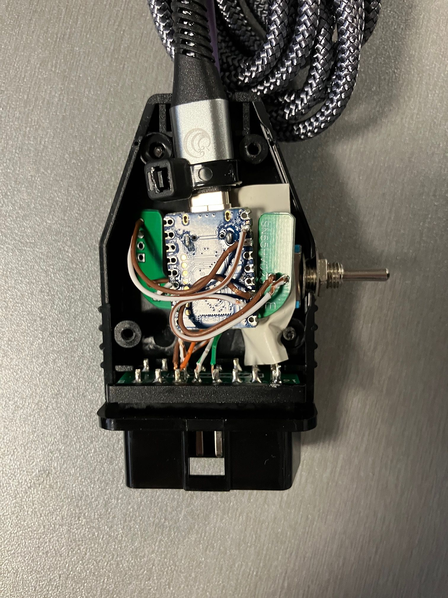
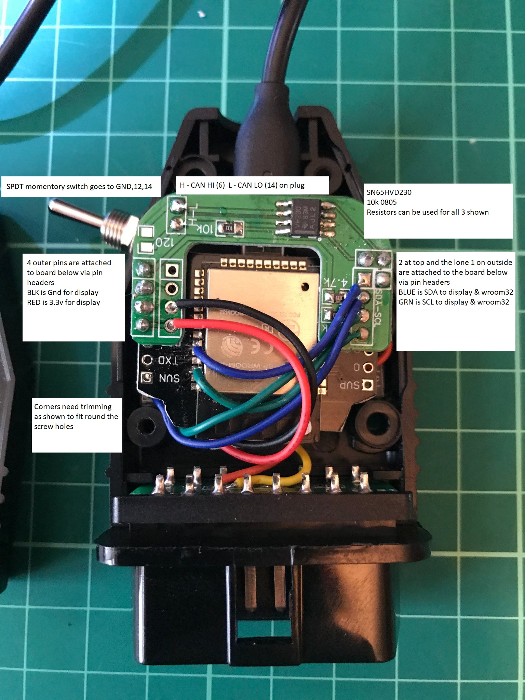
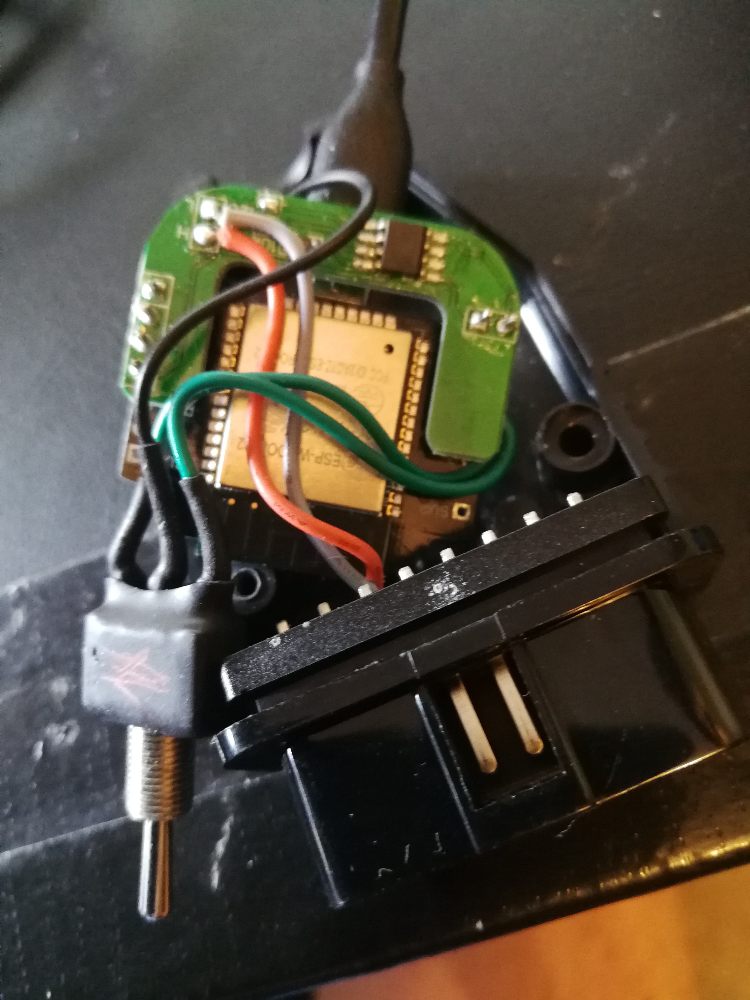
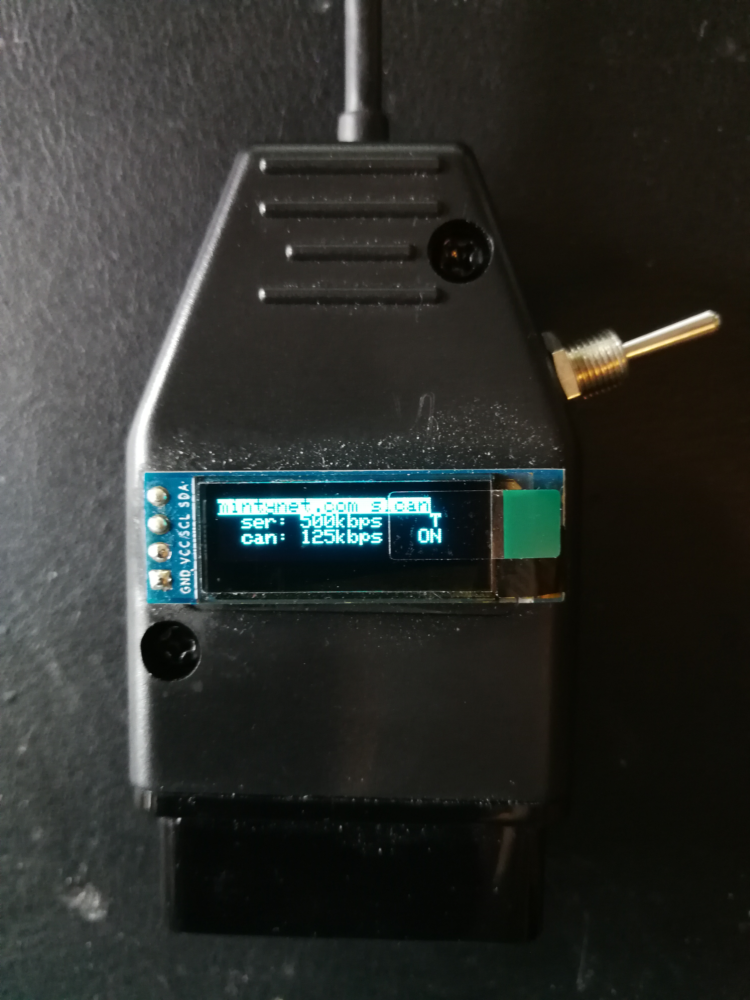
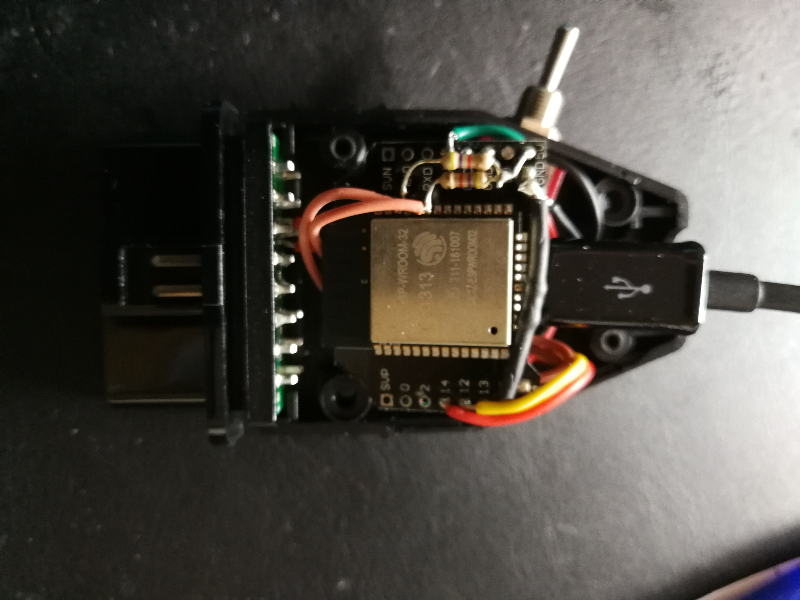
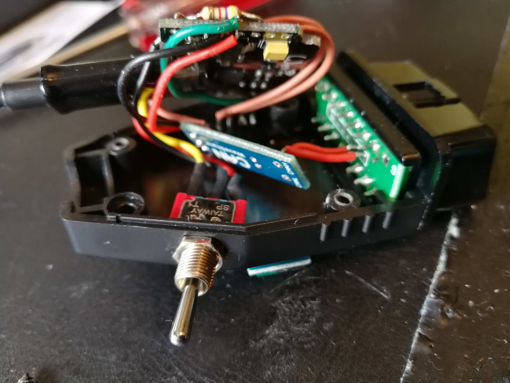

# esp32-twai-can
# THIS IS FOR Board Definition > 3.x
This folder has the new TWAI based slcan software, this is tested on an ESP32-S3, SN65HVD230 CAN transceiver
 This does NOT require any additional libraries
 
 JAN2026 this DOES NOT work with ESP32-C3 variant, it comes up correctly but does NOT TX/RX any CAN traffic.

ESP32S3 with DoIP outside

ESP32S3 with DoIP inside

# esp32-slcan & esp32-slcan-nodisp
# THIS IS FOR Board Definition 2.x
This repository has an arduino sketch to create a slcan USB/Bluetooth device using the ESP32, SN65HVD230 CAN transceiver and 128x32 SSD1306.
 Requires the use of the following Arduino libraries
  https://github.com/nhatuan84/arduino-esp32-can-demo
 Adafruit_GFX
 Adafruit_SSD1306

Current "ESP32 ESP-WROOM-32 Wemos D1" uses CP2102 USB to TTL which is limited to 500kbps
Schematic for the device to follow

Bill of materials is in "esp32-slcan BOM.txt"

Diagram that shows built insides and required wiring

Can PCB without screen

Original with screen

Inside original a

Inside original b

